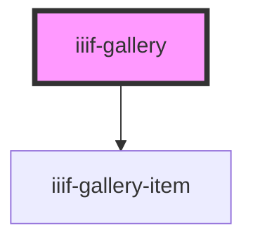

# iiif-gallery

<!-- Auto Generated Below -->

## Properties

| Property   | Attribute  | Description | Type     | Default     |
| ---------- | ---------- | ----------- | -------- | ----------- |
| `ignore`   | `ignore`   |             | `string` | `undefined` |
| `manifest` | `manifest` |             | `string` | `undefined` |

## Events

| Event              | Description | Type               |
| ------------------ | ----------- | ------------------ |
| `selectCanvas`     |             | `CustomEvent<any>` |
| `selectCollection` |             | `CustomEvent<any>` |
| `selectManifest`   |             | `CustomEvent<any>` |

## Methods

### `reset() => Promise<void>`

#### Returns

Type: `Promise<void>`

## Dependencies

### Depends on

- [iiif-gallery-item](..\iiif-gallery-item)

### Graph

----------------------------------------------

*Built with [StencilJS](https://stenciljs.com/)*
